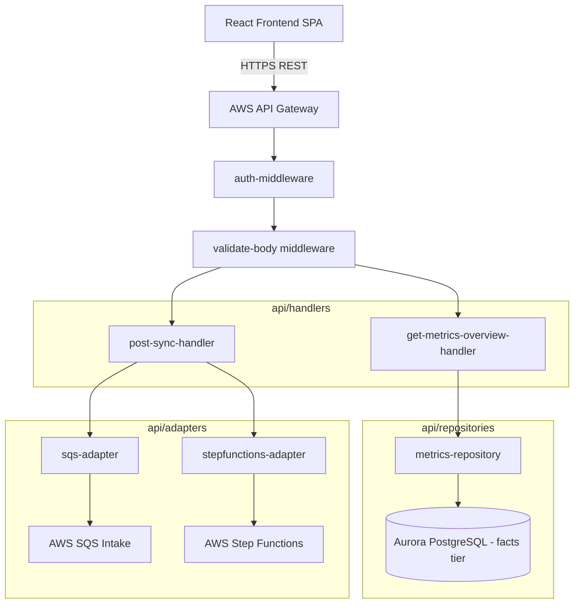

# Design Document

## Overview

The `api` sub-app provides the secure, synchronous HTTP interface for the Engineering Insights frontend. Deployed as AWS Lambda functions integrated with API Gateway, it acts strictly as an orchestration and read layer. Heavy computation is entirely avoided in this tier to guarantee high responsiveness and reliability.

## Steering Document Alignment

### Technical Standards (tech.md)
The design implements the standard single-directional dependency flow for API layers:
`Handlers → Services (if any) → Repositories / Adapters → Core / DTOs`.

### Project Structure (architecture.md)
As established in `architecture.md` (§7), the REST API provides CRUD for configurations, reads computed dashboard metrics, and triggers asynchronous jobs. Handlers never run live multi-table joins on core entities; instead, they query the `facts` namespace (Gold tier) where performance is optimized.

## Architecture

The API employs a strict separation of concerns to prevent business logic leakage.

### Modular Design Principles
- **Quarantined Infrastructure**: Interactions with AWS SDKs (SQS, Step Functions) are confined to adapters.
- **Strict Data Contracts**: All incoming request bodies and outgoing responses are validated against Zod DTOs.
- **Fail-Fast Configuration**: Cold starts validate environment variables immediately.



## Components and Interfaces

### Core Configuration
- **`config/env.ts`**: Verifies necessary DB URIs, SQS Queue URLs, and Cognito User Pool IDs at cold start.
- **`core/http.ts`**: Exposes utility functions (`ok()`, `accepted()`, `badRequest()`, `unauthorized()`) to guarantee a uniform JSON response envelope.
- **`core/middleware/auth-middleware.ts`**: Validates the incoming JWT against Cognito, extracts the `product_id`, and safely injects it into the execution context for downstream isolation.
- **`core/middleware/validate-body.ts`**: High-order function that catches Zod validation errors and automatically maps them to `400 Bad Request` responses.

### Data Contracts (DTOs)
- **`dto/metrics.ts`**: Wire contracts ensuring the frontend receives strongly typed data for dashboard rendering.
- **`dto/sync-job.ts`**: Types for job triggering requests and status polling responses.

### Adapters
- **`adapters/sqs-adapter.ts`**: Pushes ingestion trigger messages into SQS.
- **`adapters/stepfunctions-adapter.ts`**: Initiates Report Generation state machines, mapping the inputs securely.

### Repositories
- **`repositories/metrics-repository.ts`**: Reads directly from `facts.metric_fact`. Queries here are incredibly fast as the values are pre-aggregated.
- **`repositories/config-repository.ts`**: Handles reading tenant properties from `config.products` and `config.repositories`.

### Handlers
- **`get-metrics-overview-handler.ts`**: Fetches KPI-style headline numbers.
- **`get-cycle-time-handler.ts`**: Fetches the cycle time factual data scoped to a repository and date range.
- **`get-allocation-handler.ts`**: Reads developer allocation data.
- **`post-sync-handler.ts`**: Initiates an async intake job by invoking the SQS adapter. Responds `202 Accepted` with a `run_id`.
- **`get-sync-status-handler.ts`**: Reads the durable sync state by `run_id` for frontend polling.

## Data Models

### Sync Status Poll DTO
```typescript
interface SyncJobStatusResponse {
  run_id: string;
  repository_id: string;
  status: 'pending' | 'in_progress' | 'completed' | 'failed';
  stage: 'ingest' | 'normalize' | 'enrich' | 'aggregate';
  started_at: Date;
  completed_at?: Date;
  error?: string;
}
```

## Error Handling

### Error Scenarios
1. **Scenario 1:** Missing or Invalid JWT Token
   - **Handling:** `auth-middleware.ts` rejects the request.
   - **Response:** `401 Unauthorized`.
   
2. **Scenario 2:** Post Sync Payload Invalid
   - **Handling:** `validate-body.ts` catches the Zod parsing exception.
   - **Response:** `400 Bad Request` with an array of specific field errors.

3. **Scenario 3:** Downstream DB Timeout
   - **Handling:** Repository catches error, logs it structured, and throws standard internal error.
   - **Response:** `500 Internal Server Error` (no SQL details leaked to the client).
