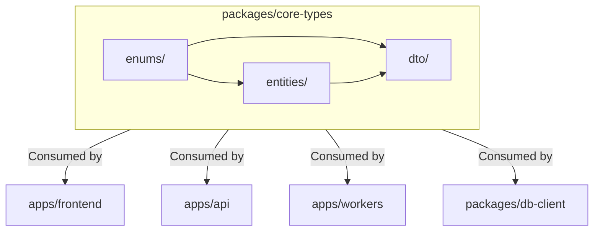

# Design Document

## Overview

The `packages/core-types` module acts as the shared vocabulary for the entire Engineering Insights platform. By defining our schema using `zod`, we achieve runtime validation for API boundaries (DTOs) and compile-time type safety across the monorepo via inferred TypeScript interfaces.

## Steering Document Alignment

### Technical Standards (tech.md)
Enforces strict type safety and schema validation. Using Zod guarantees that data entering the system (via webhooks or frontend requests) matches our domain expectations before business logic processes it.

### Project Structure (architecture.md)
Mirrors the five PostgreSQL schema namespaces exactly (`core`, `config`, `facts`, `report`, `review_lens`). It also defines the closed grain vocabulary required by the metric harness (`architecture.md` §4.4).

## Architecture

As a shared `pnpm` workspace library, `core-types` is bundled and consumed by all `apps/*` (api, frontend, integrations, workers) and other `packages/*` (db-client, connectors, harness). 

### Modular Design Principles
- **Schema-First**: Define the Zod schema first (`const UserSchema = z.object({...})`), then export the inferred type (`export type User = z.infer<typeof UserSchema>`).
- **Domain Organization**: Separate files by architectural boundary (e.g., `entities/`, `dto/`, `enums/`) rather than throwing everything into one giant file.



## Components and Interfaces

### `/enums`
- **`lifecycle.ts`**: Canonical software development lifecycle phases (`backlog`, `ready`, `in_dev`, `review`, `qa`, `done`).
- **`grains.ts`**: The allowed dimensional grains for the facts tier (`repo`, `contributor`, `cluster`, `pr`, `work_item`, `period`).
- **`roles.ts`**: Tenancy roles (e.g., `admin`, `viewer`).

### `/entities`
- **`core.ts`**: Canonical entities like `Contributor`, `WorkItem`, `GitHubPR`, `Review`, `CodeCluster`.
- **`config.ts`**: Settings models like `Product`, `Repository`, `DataConnector`, `WorkflowStatusMapping`.
- **`facts.ts`**: Metric store schemas, including the `MetricFact` shape featuring the `grain_key` and polymorphic `value_num`/`value_json`.
- **`report.ts`**: `AsyncReport`, `SignalConfig`, and `ReportSignal` definitions.
- **`review-lens.ts`**: Blindspot patterns, classifications, and rule definitions.

### `/dto`
- **`api-requests.ts`**: Payload schemas for triggering syncs, updating clusters, etc.
- **`api-responses.ts`**: Response envelopes and metric data structures served to the dashboard.
- **`webhooks.ts`**: Standardized incoming shapes from external providers before adapter parsing.

## Data Models

### Example: Metric Fact Schema (Zod)
```typescript
import { z } from 'zod';
import { GrainEnum } from '../enums/grains';

export const MetricFactSchema = z.object({
  product_id: z.string().uuid(),
  metric_name: z.string(),
  metric_version: z.number(),
  tier: z.enum(['aggregate', 'analytical']),
  grain: GrainEnum,
  
  // Nullable dimensional FKs
  repo_id: z.string().uuid().nullable(),
  contributor_id: z.string().uuid().nullable(),
  cluster_id: z.string().uuid().nullable(),
  pr_id: z.string().uuid().nullable(),
  work_item_id: z.string().uuid().nullable(),
  period_start: z.date().nullable(),
  period_end: z.date().nullable(),
  
  // Values
  value_num: z.number().nullable(),
  value_json: z.record(z.any()).nullable(),
  
  // Provenance
  grain_key: z.string(),
  run_id: z.string().uuid(),
  computed_at: z.date()
});

export type MetricFact = z.infer<typeof MetricFactSchema>;
```

## Error Handling

By strictly relying on Zod `parse()` or `safeParse()` in the consuming layers (e.g., `validate-body.ts` in the API), validation errors are caught intrinsically and immediately converted to informative error structures mapping back to these type definitions.
