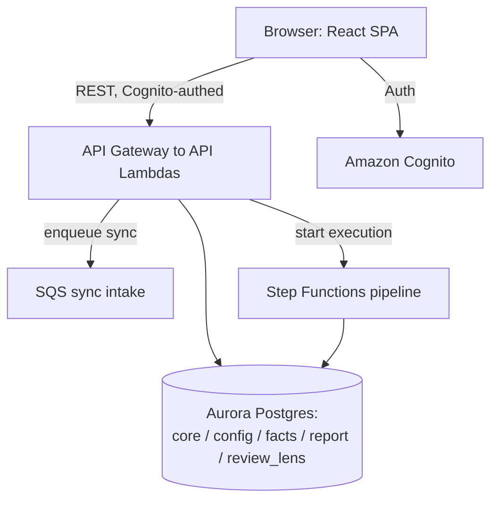
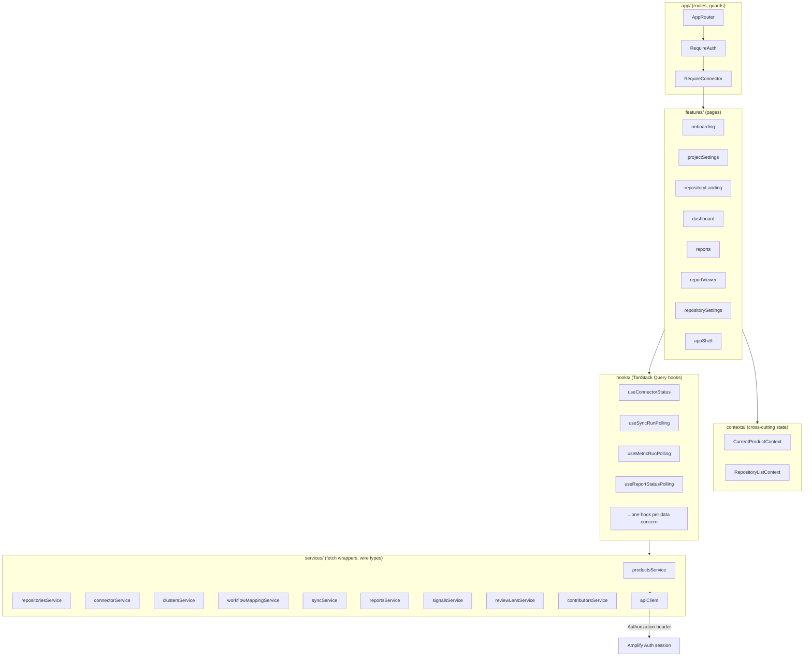

# Design Document

## Overview

This document designs the Engineering Insights frontend single-page application: the
React + TypeScript SPA described in `docs/architecture.md` Section 9, implementing the eight
screens defined by the Wireloom wireframes in `apps/frontend/docs/wireframes_v2/`. The app is
a greenfield build — `apps/frontend` currently has no `src/`.

The application:
- Authenticates users via AWS Amplify Auth (Cognito) and attaches the resulting identity
  token to every REST call.
- Routes with `react-router-dom` through an app shell (topbar + sidebar) that reflects the
  current Project's onboarding state.
- Fetches, caches, and polls data via TanStack Query, mapping directly onto the three poll
  surfaces in architecture.md Section 8 (sync run, `metric_run`, `async_reports`).
- Renders with MUI (Material UI) components: `AppBar`/`Toolbar` for the topbar, `Drawer` +
  `Accordion` for the sidebar, `Tabs`, `Card`, `Chip`/status badges, `Table`, forms via MUI
  form controls.
- Follows the `frontend/src/{app,contexts,features,hooks,services,theme,types}` layout
  mandated by architecture.md Section 9, with services owning wire types, hooks owning
  loading/error/polling state, and features composing hooks + components into pages.
- Uses no global state library — only the two cross-cutting contexts (current Project,
  repository list) hold shared state, per architecture.md Section 9.

## Steering Document Alignment

This repository does not use the standard `product.md` / `tech.md` / `structure.md` steering
document convention (none exist under a steering directory). The authoritative technical and
structural source for this feature is `docs/architecture.md` itself, particularly:

### Technical Standards (architecture.md)
- Section 1: frontend is one of three planes, talks to the API plane over REST, reflects
  live job progress by polling durable status (not websockets/SSE).
- Section 7: full REST endpoint list this app integrates against.
- Section 8: the three poll surfaces (sync run, `metric_run`, `async_reports`) and their
  polling discipline (stop at terminal state, pause when tab hidden, cadence per surface).
- Section 9: the mandated `frontend/src/` folder layout, the services/hooks/features
  layering, and "no global state library."
- Section 10: Cognito auth, tenant isolation, tokens never returned to the frontend.

Confirmed technology choices (final, not re-litigated in this document):
- React + TypeScript + Vite, routing via `react-router-dom`.
- TanStack Query (React Query) for data fetching, caching, and polling (`refetchInterval`).
- MUI (Material UI) for all UI components.
- Vitest + React Testing Library for component/unit tests (no e2e framework this phase).
- AWS Amplify Auth (Cognito) for login/session/token attachment.

### Project Structure (architecture.md Section 9)
```
frontend/src/
├── app/         routes, guards
├── contexts/    current product, repository list (the only cross-cutting state)
├── features/    onboarding · dashboard · reportViewer · settings
├── hooks/       data + polling hooks (own loading/error state and the poll lifecycle)
├── services/    one file per API resource — thin fetch wrappers owning the wire types
├── theme/       styling tokens
└── types/       shared model types
```
This design elaborates that layout with concrete files, per-screen feature folders, and the
mapping from each Section 7 endpoint group to a service module.

## Code Reuse Analysis

`apps/frontend` is a greenfield package: it currently contains only `docs/` (product design
notes and the `wireframes_v2/` Wireloom sources), `scripts/wireloom-svg.js` (a build-time tool
that renders Wireloom DSL blocks in Markdown to paired SVGs for documentation), `package.json`,
and `README.md`/`UI_DESIGN.md`. **There is no existing application code (`src/`) to leverage,
extend, or reuse.** Every component, hook, service, and route in this design is new.

The existing `package.json` and `scripts/wireloom-svg.js` are noted only as build/tooling
context — the `wireloom` devDependency and its script exist solely to keep the wireframe docs'
paired SVGs in sync and are unrelated to, and not reused by, the application runtime being
built here. This design adds application dependencies (`react`, `react-dom`, `react-router-dom`,
`@tanstack/react-query`, `@mui/material`, `@emotion/react`, `@emotion/styled`, `aws-amplify`,
`vite`, `vitest`, `@testing-library/react`) to `package.json` without disturbing the `wireloom`
script.

### Existing Components to Leverage
- None. No `src/` exists yet.

### Integration Points
- **REST API (API Gateway + Lambda, architecture.md Section 7)**: every service module in
  `services/` is a thin `fetch` wrapper against a specific resource group of this API surface.
- **Cognito (architecture.md Section 10)**: Amplify Auth manages the session; its token is
  attached to every REST call via a shared `apiClient` in `services/apiClient.ts`.
- **Wireframes (`apps/frontend/docs/wireframes_v2/*.md` + paired `.svg`)**: the structural and
  visual source of truth for every feature's component tree; each feature section below cites
  its wireframe file(s).

## Architecture

### High-Level System Placement



### Frontend Internal Architecture



### Modular Design Principles
- **Single File Responsibility**: one service file per API resource group (Products,
  Repositories, Connector, Clusters, Workflow Mapping, Sync, Reports, Signals, Review Lens,
  Contributors); one hook file per data/polling concern; one component file per wireframe
  region (header, tabs, cards, tables).
- **Component Isolation**: shared presentational primitives (status chip, sync badge, metric
  card, empty state) live in a small `components/` folder under each feature or a top-level
  `src/components/` shared library, never duplicated inline across features.
- **Service Layer Separation**: `services/` never imports React; `hooks/` never constructs a
  `fetch` call directly — it always calls a service function; `features/` never calls
  `fetch`/`services/` directly — it always calls a hook.
- **Utility Modularity**: cross-cutting concerns (relative-time formatting, polling-cadence
  constants, tab/URL sync helpers) live in small single-purpose files under `src/utils/`.

## Detailed Folder Structure

```
apps/frontend/
├── package.json                 (extended with app deps; wireloom script untouched)
├── vite.config.ts               (new)
├── tsconfig.json                (new)
├── vitest.config.ts             (new)
├── index.html                   (new)
├── docs/                        (existing — wireframes, product design notes)
├── scripts/wireloom-svg.js      (existing — untouched)
└── src/
    ├── main.tsx                        entry: Amplify.configure, QueryClientProvider, ThemeProvider, RouterProvider
    ├── app/
    │   ├── AppRouter.tsx                route tree (react-router-dom)
    │   ├── RequireAuth.tsx              guard: redirects to /login if unauthenticated
    │   ├── RequireConnector.tsx         guard: redirects to Connector if Project onboarding-pending
    │   └── routePaths.ts                typed path constants
    ├── contexts/
    │   ├── CurrentProductContext.tsx    current Project id/name/JIRA space + setter
    │   └── RepositoryListContext.tsx    current Project's repository list (id, name, status)
    ├── theme/
    │   ├── theme.ts                     MUI theme (palette, typography, shape)
    │   └── statusColors.ts              status→MUI color token mapping (success/warning/danger/research)
    ├── types/
    │   ├── product.ts, repository.ts, connector.ts, cluster.ts,
    │   │   workflowMapping.ts, syncRun.ts, report.ts, signal.ts,
    │   │   reviewLens.ts, contributor.ts, account.ts
    ├── services/
    │   ├── apiClient.ts                 fetch wrapper: base URL, Authorization header, JSON (de)serialization, error normalization
    │   ├── productsService.ts           GET/POST /products, GET /products/current, PATCH /products/current
    │   ├── repositoriesService.ts       GET/POST /repositories, GET/PATCH/DELETE /repositories/{id}, GET /repositories/{id}/stats
    │   ├── connectorService.ts          GET/PUT/POST(test)/DELETE .../connector (product- and repo-scoped)
    │   ├── clustersService.ts           GET/POST/PATCH clusters, recompute, import, DELETE data
    │   ├── workflowMappingService.ts    GET/PUT workflow-mappings, POST infer, GET statuses
    │   ├── syncService.ts               GET/POST sync, GET sync/runs[/{run_id}]
    │   ├── reportsService.ts            POST/GET reports, GET/DELETE reports/{id}, GET data, GET status
    │   ├── signalsService.ts            GET/PUT signals (signal_config)
    │   ├── reviewLensService.ts         kiro-skill artifact, refresh, status, taxonomy, rediscover, archive rule
    │   └── contributorsService.ts       GET contributors[/unresolved], GET /contributors/{id}, POST merge
    ├── hooks/
    │   ├── useCurrentProduct.ts          reads/writes CurrentProductContext
    │   ├── useRepositoryList.ts          reads RepositoryListContext, backed by useRepositories query
    │   ├── useRepositories.ts            useQuery over repositoriesService.list
    │   ├── useRepositoryStats.ts         useQuery over repositoriesService.stats (ambient cadence)
    │   ├── useConnectorStatus.ts         useQuery over connectorService.test (product- or repo-scoped)
    │   ├── useSyncRunPolling.ts          useQuery with refetchInterval over syncService.getRun; stops at terminal state
    │   ├── useMetricRunPolling.ts        useQuery with refetchInterval over a metric_run status read; stops at terminal state
    │   ├── useReportStatusPolling.ts     useQuery with refetchInterval over reportsService.getStatus; stops at terminal state
    │   ├── useReports.ts                 useQuery over reportsService.list
    │   ├── useClusters.ts                useQuery/useMutation over clustersService
    │   ├── useWorkflowMapping.ts         useQuery/useMutation over workflowMappingService
    │   ├── useGlobalSyncEvents.ts        aggregates active sync/metric/report events for the Sync Events panel + badge
    │   ├── usePageVisibility.ts          shared visibility-change hook used by all polling hooks (pause/resume)
    │   └── useDebouncedValue.ts          shared debounce for the repository search field
    ├── utils/
    │   ├── relativeTime.ts               "4m ago" formatting
    │   ├── pollingCadence.ts             ACTIVE_JOB_INTERVAL_MS, AMBIENT_INTERVAL_MS constants
    │   └── queryKeys.ts                  centralized TanStack Query key factories
    ├── components/                       shared presentational primitives, no data fetching
    │   ├── StatusChip.tsx                 maps status string → MUI Chip (success/warning/danger/research)
    │   ├── MetricCard.tsx                  hero-metric slot (value, label, "vs prev period" optional)
    │   ├── EmptyState.tsx
    │   ├── ErrorState.tsx
    │   ├── LoadingSkeleton.tsx
    │   └── SectionErrorBoundary.tsx        per-panel error boundary (Requirement 13 / NFR Reliability)
    └── features/
        ├── auth/
        │   └── LoginPage.tsx              Amplify Authenticator-based login screen
        ├── appShell/
        │   ├── AppShell.tsx                layout: Topbar + Sidebar + <Outlet/>
        │   ├── Topbar.tsx                  logo, ProjectSwitcher, Breadcrumb, SyncEventsButton, avatar/sign-out
        │   ├── ProjectSwitcher.tsx
        │   ├── Breadcrumb.tsx
        │   ├── Sidebar.tsx                 renders OnboardingSidebar or ConnectedSidebar by connector state
        │   ├── OnboardingSidebar.tsx        app-shell.md State 1
        │   ├── ConnectedSidebar.tsx         app-shell.md State 2 (Repositories accordion)
        │   └── SyncEventsPanel.tsx          global sync/job event list (Requirement 11)
        ├── onboarding/
        │   └── ConnectorPage.tsx            project-connector.md (both onboarding + connected layouts)
        │       ├── GitHubConnectorCard.tsx
        │       └── JiraConnectorCard.tsx
        ├── projectSettings/
        │   ├── ProjectSettingsLayout.tsx    project-settings.md sub-nav shell
        │   ├── MetadataPanel.tsx            project-settings.md "Metadata"
        │   ├── UserAccessPanel.tsx          disabled stub, post-MVP
        │   ├── JiraConfigurationPanel.tsx   read-only summary + link to Connector
        │   └── workflowMapping/
        │       ├── WorkflowMappingPanel.tsx      project-settings-workflow.md
        │       └── WorkflowMappingRow.tsx
        ├── repositoryLanding/
        │   ├── RepositoryLandingPage.tsx    repository-landing.md
        │   ├── RepositoryCard.tsx
        │   ├── AddRepositoryDialog.tsx
        │   └── RepositorySearchField.tsx
        ├── repositoryWorkspace/
        │   ├── RepositoryWorkspaceLayout.tsx  header + tabs shared by Dashboard/Reports/Settings
        │   ├── RepositoryHeader.tsx           identity, sync status, Sync action
        │   ├── dashboard/
        │   │   ├── DashboardPage.tsx          repository-dashboard.md
        │   │   ├── MetricStrip.tsx
        │   │   ├── PrimaryViewPanel.tsx
        │   │   └── SignalsPanel.tsx
        │   ├── reports/
        │   │   ├── ReportsPage.tsx            repository-reports.md
        │   │   ├── ReportCard.tsx
        │   │   ├── GenerateReportDialog.tsx
        │   │   └── ReportFilterMenu.tsx
        │   └── settings/
        │       ├── RepositorySettingsLayout.tsx  repository-settings.md sub-nav
        │       ├── clusters/
        │       │   ├── ClustersPanel.tsx
        │       │   ├── ClusterTable.tsx
        │       │   ├── ClusterFormDialog.tsx
        │       │   └── ImportClustersDialog.tsx
        │       └── connectorOverride/
        │           └── ConnectorOverridePanel.tsx  reuses GitHubConnectorCard/JiraConnectorCard
        └── reportViewer/
            ├── ReportViewerPage.tsx        report-viewer.md
            ├── ReportKpiStrip.tsx
            ├── SignalCard.tsx
            └── ReportGenerationProgress.tsx  shown when status != completed (Req 9.5)
```

## Components and Interfaces

Only the non-obvious / cross-cutting components are detailed below; the folder structure
above is the full inventory.

### AppRouter (`app/AppRouter.tsx`)
- **Purpose:** Defines the full route tree and wires guards.
- **Interfaces:** Default export, a React component rendering a `RouterProvider` (data
  router) or `<Routes>` tree.
- **Dependencies:** `RequireAuth`, `RequireConnector`, all `features/*Page` components.
- **Reuses:** N/A (new).
- **Route tree:**
  ```
  /login                                  LoginPage (public)
  /                                        RequireAuth → AppShell
    /connector                             ConnectorPage
    /settings                              RequireConnector → ProjectSettingsLayout
      /settings/metadata
      /settings/jira-configuration
      /settings/workflow-mapping
    /repositories                          RequireConnector → RepositoryLandingPage
    /repositories/:repoId                  RequireConnector → RepositoryWorkspaceLayout
      /repositories/:repoId/dashboard
      /repositories/:repoId/reports
      /repositories/:repoId/reports/:reportId   ReportViewerPage
      /repositories/:repoId/settings
        /repositories/:repoId/settings/clusters
        /repositories/:repoId/settings/connector-override
  ```

### RequireAuth (`app/RequireAuth.tsx`)
- **Purpose:** Implements Requirement 1.1/1.3/2.8 — blocks rendering and redirects to
  `/login` when there is no valid Amplify session; restores session on reload (1.4).
- **Interfaces:** `<RequireAuth><Outlet/></RequireAuth>` wrapper; internally uses Amplify's
  `getCurrentUser()`/`fetchAuthSession()` and a small `useAuthSession()` hook.
- **Dependencies:** `aws-amplify/auth`.
- **Reuses:** N/A.

### RequireConnector (`app/RequireConnector.tsx`)
- **Purpose:** Implements Requirement 2.9 — redirects to `/connector` when the current
  Project has no working connector.
- **Interfaces:** `<RequireConnector><Outlet/></RequireConnector>`.
- **Dependencies:** `useConnectorStatus` hook, `useCurrentProduct`.
- **Reuses:** N/A.

### apiClient (`services/apiClient.ts`)
- **Purpose:** Single choke point for every REST call: resolves base URL, attaches the
  Cognito identity token (via Amplify's `fetchAuthSession`) as `Authorization: Bearer
  <token>`, serializes/deserializes JSON, and normalizes errors into a typed `ApiError` (with
  `status`, `code`, `message`) so hooks/features never see raw `fetch` rejects or parse HTTP
  status codes themselves.
- **Interfaces:**
  ```ts
  function apiFetch<T>(path: string, init?: RequestInit): Promise<T>;
  class ApiError extends Error { status: number; body: unknown; }
  ```
- **Dependencies:** `aws-amplify/auth` (token), `fetch`.
- **Reuses:** N/A. Every other `*Service.ts` file calls only `apiFetch`.
- **On 401:** rejects with `ApiError{status:401}`; a top-level `QueryClient` `onError`/
  `RequireAuth` combination clears session and redirects to login (Requirement 1.3).

### Service modules (`services/*.ts`)
Each service is a thin, framework-free module: it owns the wire (request/response) TypeScript
types for its resource group and exposes plain async functions built on `apiFetch`. Example
shape (repositoriesService):
```ts
export interface RepositoryDTO { id: string; key: string; displayName: string; status: string;
  githubOwner: string; githubRepo: string; jiraProjectKey: string; ticketKeyPattern: string; }
export interface RepositoryStatsDTO { /* Gold-fact hero metrics, shape TBD by facts API */ }
export function listRepositories(): Promise<RepositoryDTO[]>;
export function getRepository(id: string): Promise<RepositoryDTO>;
export function createRepository(input: CreateRepositoryInput): Promise<RepositoryDTO>;
export function updateRepository(id: string, patch: Partial<CreateRepositoryInput>): Promise<RepositoryDTO>;
export function deleteRepository(id: string): Promise<void>;
export function getRepositoryStats(id: string): Promise<RepositoryStatsDTO>;
```
The full endpoint-to-service mapping is in "Data Models and Service Mapping" below.

### Polling hooks (`hooks/use*Polling.ts`)
- **Purpose:** Own loading/error/data/polling-lifecycle state for one poll surface
  (Requirement 12, architecture.md Section 8). Each wraps a TanStack `useQuery` with
  `refetchInterval` computed from the fetched data's status, stopping (returning `false`) at
  a terminal state, and integrates `usePageVisibility` to pause while the tab is hidden.
- **Interfaces (representative — `useSyncRunPolling`):**
  ```ts
  function useSyncRunPolling(repoId: string, runId?: string): {
    run: SyncRunDTO | undefined;
    status: 'pending' | 'running' | 'completed' | 'failed';
    isLoading: boolean;
    error: ApiError | null;
  };
  ```
- **Dependencies:** `syncService.getRun` / `getLatestRun`, `usePageVisibility`,
  `pollingCadence.ACTIVE_JOB_INTERVAL_MS`.
- **Reuses:** the same `refetchInterval`-terminal-state pattern is shared (as a small
  internal helper, `createPollingQueryOptions`) by `useMetricRunPolling` and
  `useReportStatusPolling` — this is the one piece of "shared logic" in the hook layer,
  living in `hooks/internal/pollingQueryOptions.ts`.

### Contexts
- **CurrentProductContext**: `{ product: ProductDTO | null, setProductId: (id: string) => void }`.
  Populated from `GET /products/current` (or the user's selected Project after switching);
  read by nearly every feature and the `RequireConnector` guard.
- **RepositoryListContext**: `{ repositories: RepositoryDTO[] }`, backed by `useRepositories()`
  (a `useQuery`), consumed by the Sidebar's Repositories accordion and Repository Landing so
  both stay in sync off one cached list.

## Data Models and Service Mapping

Wire types live in `services/*.ts` (owned by the service, per architecture.md Section 9);
`types/*.ts` holds shared, service-agnostic model shapes referenced by multiple features
(e.g., a `Grain`/`MetricValue` shape used by both Dashboard and Report Viewer).

| Architecture §7 area | Service file | Endpoints | Consumed by |
|---|---|---|---|
| Products / Repositories | `productsService.ts`, `repositoriesService.ts` | `GET/POST /products`, `GET /products/current`, `GET/POST /repositories`, `GET/PATCH/DELETE /repositories/{id}`, `GET /repositories/{id}/stats` | ProjectSwitcher, MetadataPanel, RepositoryLandingPage, RepositoryHeader, DashboardPage |
| Connectors | `connectorService.ts` | `GET/PUT/POST(test)/DELETE /products/current/connector`, same under `/repositories/{id}/connector` | ConnectorPage, ConnectorOverridePanel, RequireConnector, Sidebar |
| Clusters | `clustersService.ts` | `GET/POST /repositories/{id}/clusters`, `PATCH .../clusters/{id}`, `POST .../clusters/recompute`, `POST .../clusters/import`, `DELETE .../data` | ClustersPanel, ClusterTable, ClusterFormDialog, ImportClustersDialog |
| Workflow mapping | `workflowMappingService.ts` | `GET/PUT /repositories/{id}/workflow-mappings`, `POST .../infer`, `GET .../statuses` | WorkflowMappingPanel — **scope caveat:** `project-settings-workflow.md` establishes that, because Jira is Project-scoped (1-1 with a Project's Jira space), workflow mapping is per-Project (`UNIQUE(project_id, jira_status)`), while architecture.md Sections 4.3/7 still document the repo-scoped `{id}` key as a pending doc follow-up. `workflowMappingService`'s functions therefore take the **current Project's id**, not a specific repository id, even though they call the `/repositories/{id}/workflow-mappings`-shaped path (using the Project's id in the `{id}` slot until the backend/architecture.md doc is updated to a dedicated `/products/current/workflow-mappings` path). `WorkflowMappingPanel` lives under `features/projectSettings/`, confirming it is invoked once per Project, not once per repository. |
| Sync | `syncService.ts` | `GET/POST /repositories/{id}/sync`, `GET .../sync/runs[/{run_id}]` | RepositoryHeader (Sync action), useSyncRunPolling, RepositoryCard (landing), SyncEventsPanel |
| Aggregation (`metric_run`) | *(no dedicated service — open item)* | **Open question, not yet backed by an endpoint:** architecture.md Section 8 names `metric_run` as poll surface #2 ("Aggregation progress"), but Section 7's endpoint list exposes no explicit `metric_run` read path — the closest documented read is `GET /repositories/{id}/stats`. `useMetricRunPolling` (hooks layer) is implemented against `repositoriesService.getRepositoryStats` as a stand-in, with an explicit code comment flagging the assumption for API-team confirmation; if `GET /repositories/{id}/stats` does not in fact surface `metric_run` status/progress fields, this hook's data source must be revisited once a real endpoint is added to architecture.md Section 7. | useMetricRunPolling (used by Dashboard/global Sync Events for aggregation-progress display) |
| Reports | `reportsService.ts` | `POST/GET /repositories/{id}/reports`, `GET/DELETE .../reports/{id}`, `GET .../reports/{id}/data`, `GET .../reports/{id}/status` | ReportsPage, ReportCard, GenerateReportDialog, ReportViewerPage, useReportStatusPolling |
| Signals | `signalsService.ts` | `GET/PUT /repositories/{id}/signals` | **Data-source caveat:** this endpoint is `signal_config` (declarative drift-rule definitions), not fired `report_signal` instances — architecture.md Section 7 exposes no endpoint for "currently fired signals outside a specific report." The Dashboard's Signals panel (Requirement 7.2) is therefore implemented as a **placeholder panel in this phase** (structurally identical treatment to the adjacent "Secondary" panel), not wired to live fired-signal data; `signalsService` itself is still implemented against `signal_config` for forward use by a future signal-configuration admin surface, but no Dashboard component reads fired signals from it. |
| Review Lens | `reviewLensService.ts` | `GET .../artifacts/kiro-skill`, `POST .../review-lens/refresh`, `GET .../review-lens/status`, `GET .../review-lens/taxonomy`, `POST .../review-lens/taxonomy/rediscover`, `POST .../review-lens/rules/{id}/archive` | not required by any wireframed screen in this phase; service stubbed with typed signatures for forward-compatibility, no UI consumes it yet |
| Contributors | `contributorsService.ts` | `GET /repositories/{id}/contributors[/unresolved]`, `GET /contributors/{id}`, `POST /contributors/merge` | not required by any wireframed screen in this phase; service stubbed for forward-compatibility |

Note: Review Lens and Contributors services are included in the design for API-surface
completeness (Section 7 lists them) but no requirement or wireframe in this spec renders UI
against them; the tasks document scopes their implementation to typed service stubs only, not
full hook/feature wiring, to avoid building unused UI.

### Model: Repository (core shape used across Landing, Workspace, Settings)
```
RepositoryDTO
- id: string
- key: string
- displayName: string
- status: 'onboarding' | 'syncing' | 'synced' | 'error'
- githubOwner: string
- githubRepo: string
- jiraProjectKey: string
- ticketKeyPattern: string
- lastSyncedAt: string | null (ISO 8601)
```

### Model: Sync Run (poll surface #1, architecture.md §8)
```
SyncRunDTO
- id: string
- repositoryId: string
- status: 'pending' | 'running' | 'completed' | 'failed'
- startedAt: string
- completedAt: string | null
- errorMessage: string | null
```

### Model: Metric Run (poll surface #2, architecture.md §8, backs aggregation progress)
```
MetricRunDTO
- id: string
- repositoryId: string
- status: 'pending' | 'running' | 'completed' | 'failed'
- metricsWritten: number
- startedAt: string
- completedAt: string | null
```

### Model: Async Report (poll surface #3, architecture.md §8 / §4.5)
```
AsyncReportDTO
- id: string
- repositoryId: string
- reportType: string
- period: string                 (e.g. "2026-W06")
- periodStart: string
- periodEnd: string
- status: 'pending' | 'generating' | 'completed' | 'failed'
- stage: string | null            (e.g. "signals")
- progress: number | null         (0-100, if provided by the status endpoint)
- signalCount: number | null
- retryCount: number
- errorMessage: string | null
- generatedAt: string | null
```

### Model: Report Signal (report-viewer.md)
```
ReportSignalDTO
- id: string
- reportId: string
- headline: string
- severity: 'low' | 'medium' | 'high'
- narrative: string
- evidence: Record<string, unknown>   (frozen fact ids/values, opaque to the frontend)
```

### Model: Cluster (repository-settings.md)
```
ClusterDTO
- id: string
- name: string
- filePattern: string
- curationStatus: 'auto' | 'confirmed' | 'renamed' | 'manual' | 'archived'
- fileCount: number
```

### Model: Workflow Mapping (project-settings-workflow.md)
```
WorkflowMappingDTO
- jiraStatus: string
- phase: 'backlog' | 'ready' | 'in_dev' | 'str' | 'qa' | 'done' | null
- inferred: boolean       (true if suggested by POST .../infer and not yet confirmed)
- confirmed: boolean
```

### Model: Connector (project-connector.md, repository-settings.md override)
```
ConnectorDTO
- source: 'github' | 'jira'
- scope: 'product' | 'repository'
- connected: boolean            (result of the last test_connectivity() call)
- installationOrAccount: string | null
- tokenVersion: number | null
- lastRotatedAt: string | null
- cloudSite: string | null       (jira only)
- spaceKey: string | null        (jira only)
```

## Error Handling

### Error Scenarios
1. **Unauthenticated / expired session (401 from any endpoint).**
   - **Handling:** `apiClient` throws `ApiError{status:401}`; a top-level TanStack Query
     `QueryCache` `onError` (or a response interceptor) clears the Amplify session and
     `queryClient.clear()`s cached data, then the router redirects to `/login`.
   - **User Impact:** User is returned to the login screen; on re-login they land back on
     their last-intended route (Requirement 1.2/1.3).

2. **Connector not yet working (onboarding-pending) but user deep-links to a locked route.**
   - **Handling:** `RequireConnector` guard checks `useConnectorStatus`; if not connected,
     `<Navigate to="/connector" replace />`.
   - **User Impact:** User lands on the Connector screen instead of a broken/locked page
     (Requirement 2.9).

3. **REST call fails with 4xx/5xx (e.g., validation error on Save, 409 on duplicate
   repository key or duplicate report).**
   - **Handling:** The mutating hook (`useMutation`) surfaces `error` from the typed
     `ApiError`; the feature component renders an inline, human-readable message (never the
     raw error body) next to the affected control, and leaves prior form values intact so the
     user can correct and retry (Requirement 4.3/13.2, Requirement 6.5/8.5).
   - **User Impact:** Clear, actionable inline error; no data loss; retry re-attempts the
     same mutation (Requirement 13.4).

4. **Network unavailable.**
   - **Handling:** `apiFetch` catches the network-level rejection (distinct from an HTTP
     error response) and throws an `ApiError` with a sentinel `status: 0` /
     `code: 'NETWORK_ERROR'`; `ErrorState` renders connectivity-specific copy.
   - **User Impact:** Sees "You appear to be offline" rather than a generic/server-error
     message (Requirement 13.3).

5. **A single panel's poll/query fails while the rest of the page is healthy** (e.g.,
   Signals panel 500s while Metric Strip succeeds).
   - **Handling:** Each independently-fetched panel (`MetricStrip`, `PrimaryViewPanel`,
     `SignalsPanel`) is wrapped in its own `SectionErrorBoundary` + owns its own query; a
     failure in one does not unmount or block the others.
   - **User Impact:** Partial page renders correctly with one panel showing `ErrorState`
     (Requirement 7.5 / NFR Reliability).

6. **Report/entity deleted between list fetch and navigation (404 on Report Viewer,
   Repository Workspace, etc.).**
   - **Handling:** The page-level query's `error` (404) renders a full-page `ErrorState` with
     a "Back to Reports" (or equivalent parent-list) action instead of attempting to render a
     partial/undefined-data layout.
   - **User Impact:** Clear dead-end recovery path (Requirement 9.6).

## Testing Strategy

### Unit Testing
- **Services:** mock `apiClient.apiFetch` (via `vi.mock`) and assert each service function
  builds the correct path/method/body and maps the response to its typed DTO shape — one
  test file per service (e.g., `reportsService.test.ts`).
- **Hooks:** test with `@testing-library/react`'s `renderHook` inside a `QueryClientProvider`
  test wrapper; mock the underlying service call; verify loading → success/error transitions,
  and for polling hooks, verify `refetchInterval` stops once mocked data reaches a terminal
  status (Requirement 12.1) and that a `document.hidden` toggle (via
  `Object.defineProperty(document, 'hidden', ...)` + a `visibilitychange` dispatch) pauses/
  resumes polling (Requirement 12.2).
- **Presentational components:** Vitest + React Testing Library render tests per component
  (e.g., `StatusChip` renders the right color/label per status; `RepositoryCard` renders
  spinner vs. last-synced copy per Requirement 6.2).

### Integration Testing
- **Feature-level tests** render a full feature page (e.g., `ReportsPage`) inside a test
  `QueryClientProvider` + `MemoryRouter`, with `msw` (Mock Service Worker) or direct service
  mocks simulating a sequence of API responses, to verify:
  - Requirement 8.3: a generating report's card updates from "Generating" to "Completed"
    across simulated poll ticks.
  - Requirement 3.7 / 2.9: transitioning a mocked connector from disconnected → connected
    unlocks the sidebar's Settings/Repositories and un-redirects a previously-guarded route.
  - Requirement 6.4/6.5: submitting the Add Repository form with a colliding `key` surfaces
    the 409 as a field-level error and does not add a duplicate card.
  - Requirement 9.5: opening a report mid-generation renders the progress view, then
    switches to the completed brief layout once the mocked status poll returns `completed`.

### End-to-End Testing
- Out of scope for this phase per the confirmed tech stack (Vitest + RTL only, no e2e
  framework). The integration tests above cover the equivalent user-visible flows at the
  component-tree level instead of a real browser.
