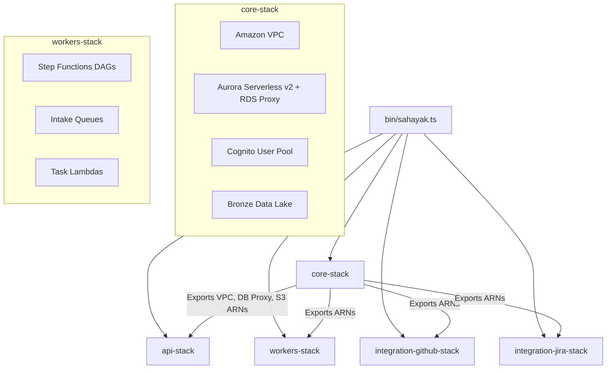

# Design Document

## Overview

The `infra/` sub-app manages the AWS Cloud Topology via the AWS Cloud Development Kit (CDK) in TypeScript. At the root level, `turbo.json` coordinates the monorepo build tasks across the infrastructure and the application code. This setup ensures that deployments are modular, repeatable, and aligned perfectly with the architecture boundaries defined for Engineering Insights.

## Steering Document Alignment

### Technical Standards (tech.md)
We leverage AWS CDK to declare serverless infrastructure as code, preventing configuration drift and keeping application logic tightly coupled with its cloud permissions (IAM).

### Project Structure (architecture.md)
The architecture clearly defines multiple planes (API, Background Workers, Integrations). This is mirrored in our CDK stack design. `bin/sahayak.ts` serves as the entry point orchestrator that connects the foundational `core-stack` to the dependent downstream stacks.

## Architecture

### Monorepo Build Orchestration (`turbo.json`)
The `turbo.json` file handles topological building. It understands that `apps/api` depends on `packages/core-types` and `packages/db-client`.
Key pipelines include:
- `build`: Generates TypeScript outputs with aggressive caching.
- `lint`: Ensures code quality.
- `deploy`: Runs `cdk deploy` within the `infra/` app.

### AWS Cloud Topology (CDK)
The CDK application is organized hierarchically to pass essential ARNs (VPC, DB, S3) from the core to the consuming stacks.

## Components and Interfaces

### Turborepo
- **`turbo.json`**: Root-level configuration mapping out task dependencies (e.g., `build` depends on `^build`).

### AWS CDK App
- **`infra/bin/sahayak.ts`**: The main CDK application. It reads context, instantiates the `core-stack`, and passes its outputs as `props` to the subsequent stacks.
- **`infra/lib/config.ts`**: Helper to load and validate environment-specific profiles (e.g., dev, prod) from CDK context.

### Stacks
- **`infra/lib/core-stack.ts`**: 
  - Provisions the VPC with private subnets.
  - Deploys the Aurora PostgreSQL cluster and RDS Proxy (crucial for Lambda connection pooling).
  - Deploys Cognito User Pools and the Bronze S3 Bucket.
- **`infra/lib/api-stack.ts`**:
  - Sets up AWS API Gateway (REST API).
  - Bundles and attaches Lambdas from `apps/api`.
  - Attaches Cognito Authorizers to endpoints.
- **`infra/lib/integration-github-stack.ts`** & **`integration-jira-stack.ts`**:
  - Independent API Gateways exposing public callback endpoints.
  - Bundles Lambdas from `apps/integration-*`.
  - Injects AWS Secrets Manager ARNs into Lambda environments.
- **`infra/lib/workers-stack.ts`**:
  - Provisions SQS Queues for intake.
  - Constructs the Step Function State Machines (ingest, normalize, enrich, aggregate) using ASL (Amazon States Language) constructs.
  - Bundles Lambdas from `apps/workers`.
  - Grants `bedrock:InvokeModel` IAM permissions to the enrich task.

## Error Handling & Deployment

### Deployment Scenarios
1. **Scenario 1:** CDK context missing required variables
   - **Handling:** `config.ts` throws an error during the synth phase.
   - **User Impact:** CI/CD pipeline fails fast before attempting any AWS mutations.
2. **Scenario 2:** Stack Circular Dependencies
   - **Handling:** Resolved architecturally by ensuring all data flows outwards from `core-stack` to the application stacks.
