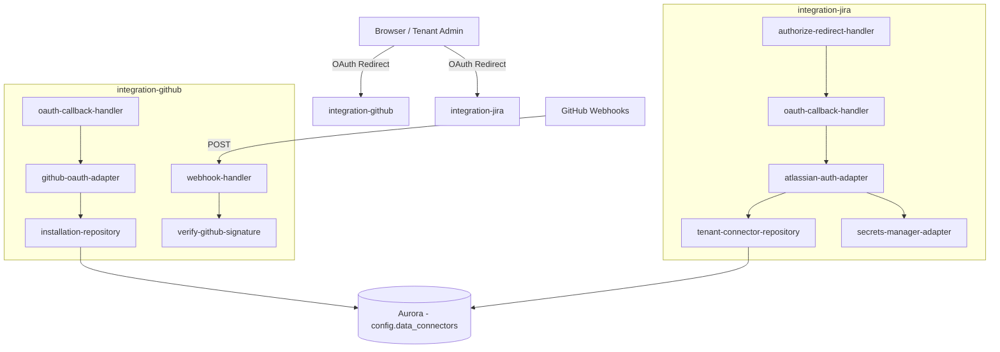

# Design Document

## Overview

The `integration-github` and `integration-jira` sub-apps form the boundary layer for securely onboarding third-party API access into Engineering Insights. Given their sensitive role in exchanging temporary grant codes for persistent access tokens, they are architected as standalone serverless applications (deployables) independent of the main API plane. This strictly isolates the security surface area and limits the blast radius of any potential compromise.

## Steering Document Alignment

### Technical Standards (tech.md)
The design enforces strict boundaries where HTTP handlers perform only validation and routing, while repositories handle data persistence. All external secret management leverages AWS Secrets Manager and tenant tokens are encrypted at rest using Aurora's capabilities.

### Project Structure (architecture.md)
Following `architecture.md` (§3 and §10), these integration apps reside in `apps/integration-github/` and `apps/integration-jira/`. They communicate with the `core-types` and `db-client` packages but do not contain heavy business logic or analytical processing, serving strictly as setup and webhook ingestion gateways.

## Code Reuse Analysis

### Existing Components to Leverage
- **`packages/db-client`**: Will be used by the repository layer (`installation-repository.ts` and `tenant-connector-repository.ts`) to persist configurations securely to the `config.data_connectors` table.
- **`packages/core-types`**: Will provide the DTO definitions for webhook payloads and token structures.

### Integration Points
- **AWS Secrets Manager**: Integrated via `secrets-manager-adapter.ts` to securely load the GitHub App private key and Atlassian OAuth client secrets at runtime.
- **Aurora PostgreSQL (Serverless v2)**: The `config` schema will store the resulting tenant connectors with encrypted key columns.

## Architecture

Both apps follow a lightweight API Gateway to Lambda pattern. 

### Modular Design Principles
- **Boundary Validation First**: Cryptographic signature validation happens immediately in middleware (`verify-github-signature.ts`).
- **Adapter Pattern for SDKs**: Interaction with GitHub and Jira OAuth servers is quarantined in dedicated adapter files (`github-oauth-adapter.ts`, `atlassian-auth-adapter.ts`).
- **Repository Pattern**: Database interactions for storing connectors are isolated in repository classes.



## Components and Interfaces

### integration-github

- **`config/env.ts`**: Validates required environment variables (App ID, Secrets).
- **`verify-github-signature.ts`**: Middleware that computes HMAC-SHA256 from the incoming webhook body and compares it against `x-hub-signature-256`.
- **`github-oauth-adapter.ts`**: Exchanges temporary setup codes for GitHub installation IDs and access tokens.
- **`installation-repository.ts`**: Commits the validated installation token into the `data_connectors` table for the corresponding product/repository.
- **`oauth-callback-handler.ts`**: API entry point that receives the GitHub setup redirect and orchestrates the adapter and repository.
- **`webhook-handler.ts`**: Acknowledges and securely logs workspace repository grants and removals.

### integration-jira

- **`config/env.ts`**: Validates Atlassian integration client secrets and IDs.
- **`atlassian-auth-adapter.ts`**: Manages the 3-legged OAuth exchange and refresh token procedures against the Atlassian API.
- **`secrets-manager-adapter.ts`**: Securely fetches the Atlassian Client Secret from AWS Secrets Manager to prevent exposure in environment variables.
- **`tenant-connector-repository.ts`**: Writes active connection configurations and tokens to `config.data_connectors`, managing the versioned encryption keys.
- **`authorize-redirect-handler.ts`**: Generates a CSRF state token and redirects the admin to the Atlassian consent screen.
- **`oauth-callback-handler.ts`**: Catches the Atlassian verification signal, validates the state, retrieves tokens via the adapter, and maps them via the repository.

## Data Models

### Data Connector (config namespace)
```typescript
interface DataConnector {
  id: string; // uuid
  product_id: string;
  repository_id?: string | null; // Null if product-level default
  connector_type: 'github' | 'jira';
  credentials_ciphertext: string;
  key_version: number;
  created_at: Date;
  updated_at: Date;
}
```

## Error Handling

### Error Scenarios
1. **Scenario 1:** Invalid GitHub Webhook Signature
   - **Handling:** Middleware throws a 401 Unauthorized immediately.
   - **User Impact:** GitHub receives a 401. No database or internal systems are touched.

2. **Scenario 2:** OAuth State Mismatch (Jira)
   - **Handling:** `oauth-callback-handler` detects invalid state parameter, throws 403 Forbidden.
   - **User Impact:** Admin is shown an "Authentication failed due to invalid state" page, preventing CSRF attacks.

## Testing Strategy

### Unit Testing
- Test cryptographic signature verification with mock payloads and known secrets.
- Test adapter layer with mocked HTTP responses for token exchanges.

### Integration Testing
- Verify that valid OAuth callbacks correctly persist encrypted rows in the `config` schema using a local Postgres database.
