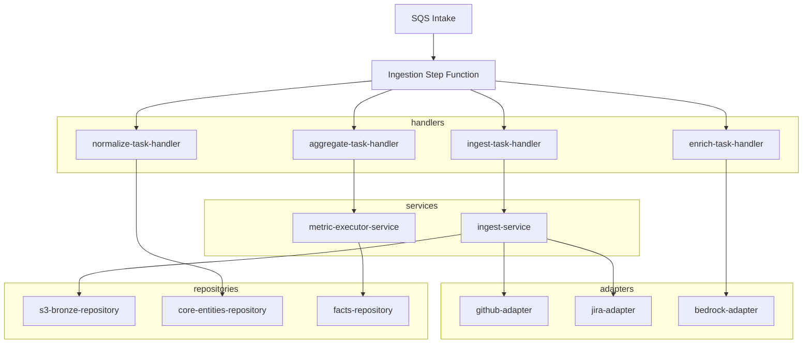

# Design Document

## Overview

The `workers` sub-app implements the asynchronous pipeline plane for Engineering Insights. It consists of Step Function tasks triggered by SQS or scheduled events. This sub-app handles data ingestion from connectors (GitHub, Jira), normalization into core entities, LLM-based enrichment (Bedrock), and metric aggregation.

## Steering Document Alignment

### Technical Standards (tech.md)
The pipeline strictly adheres to the medallion architecture:
- **Bronze (Raw)**: Unparsed JSON stored immutably in S3.
- **Silver (Core Entities)**: Normalized identities, items, and clusters with foreign keys in Aurora PostgreSQL.
- **Gold (Facts)**: Pre-computed metrics with standard dimensional modeling.

### Project Structure (architecture.md)
The `workers` app contains all background tasks and Step Function orchestrators. To avoid the 15-minute Lambda execution limit, unbounded data processing (e.g., historical syncs) is implemented using Step Functions `Map` chunks, coordinated via the `pipeline.ts` core utilities.

## Code Reuse Analysis

### Existing Components to Leverage
- **`packages/harness`**: Used by `metric-executor-service.ts` to execute registry SQL queries in DAG order.
- **`packages/connectors`**: Reused for standard communication patterns.
- **`packages/db-client`**: Underlying Aurora access.

### Integration Points
- **Amazon S3**: Bronze layer data lakes managed by `s3-bronze-repository.ts`.
- **Amazon Aurora PostgreSQL (Serverless v2)**: Storage backend mutated by `core-entities-repository.ts` and `facts-repository.ts`.
- **Amazon Bedrock**: Integrated via `bedrock-adapter.ts` to perform sentiment and taxonomy analysis on PRs/Comments.

## Architecture

The system executes as AWS Lambda tasks managed by AWS Step Functions and SQS. The layer isolation prevents mixing SFN logic with HTTP boundaries.

### Modular Design Principles
- **Idempotency**: All writes must support re-runs. `facts-repository.ts` handles Gold upserts using `grain_key` locks.
- **Bounded Invocations**: Tasks implement chunking and avoid holding long-lived DB connections for API pagination tasks.
- **Event-Driven**: Handlers skip HTTP parsing entirely, expecting SQS `Records` or Step Function payload inputs.

## Components and Interfaces

### Core System
- **`config/env.ts`**: Validates DB connections and Bedrock configurations.
- **`core/errors.ts`**: Contains error taxonomy specifically designed to trigger Step Function backoff policies vs terminal failure transitions.
- **`core/pipeline.ts`**: Context wrappers to manage and construct Step Function map context.
- **`dto/pipeline-payloads.ts`**: Defines strict Zod schemas for internal state chunks passed between Step Function states.

### Adapters
- **`adapters/github-adapter.ts`**: GitHub REST client handling backoff pagination.
- **`adapters/jira-adapter.ts`**: Jira REST client handling cursor pagination.
- **`adapters/bedrock-adapter.ts`**: Safely wraps Bedrock invoke calls with internal retry safety and token constraints.

### Repositories
- **`repositories/s3-bronze-repository.ts`**: Writes raw JSON payloads directly to S3.
- **`repositories/core-entities-repository.ts`**: Mutates Silver tables (e.g., `work_items`, `github_prs`) and resolves canonical identities.
- **`repositories/facts-repository.ts`**: Manages Gold upserts using `grain_key` locks to guarantee exactly-once writing logic.

### Services
- **`services/ingest-service.ts`**: Coordinates streaming responses from adapters to the S3 repository and updates the high-water sync state.
- **`services/metric-executor-service.ts`**: Reads the metric registry and executes SQL statements in topological DAG order.

### Handlers (Events)
- **`handlers/events/sqs-intake-handler.ts`**: Triggers Step Function execution based on SQS messages.
- **`handlers/events/*-task-handler.ts`**: Pure SFN task Lambdas (ingest, normalize, enrich, aggregate) devoid of HTTP abstractions.

## Error Handling

### Error Scenarios
1. **Scenario 1:** Bedrock Rate Limit Exceeded
   - **Handling:** `bedrock-adapter.ts` throws a categorized `TransientRateLimitError` defined in `errors.ts`.
   - **System Impact:** Step Functions catch this specific error and apply a predefined backoff strategy, avoiding immediate failure.
2. **Scenario 2:** Upsert Deadlock in Facts Table
   - **Handling:** `facts-repository.ts` gracefully retries, adhering to transaction boundaries.
